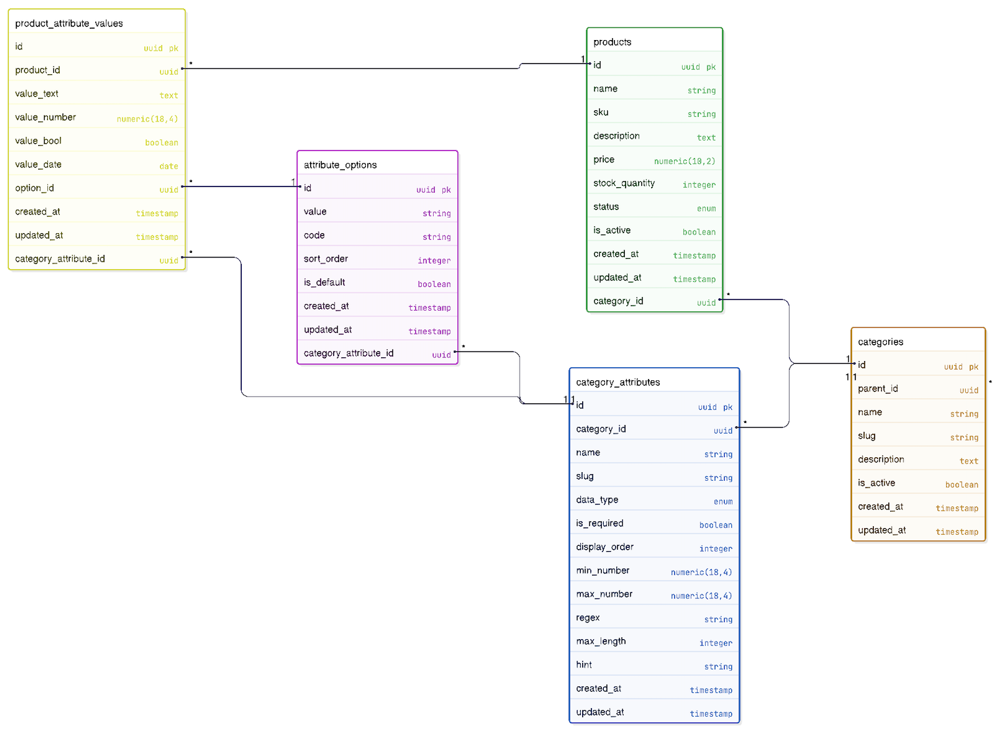
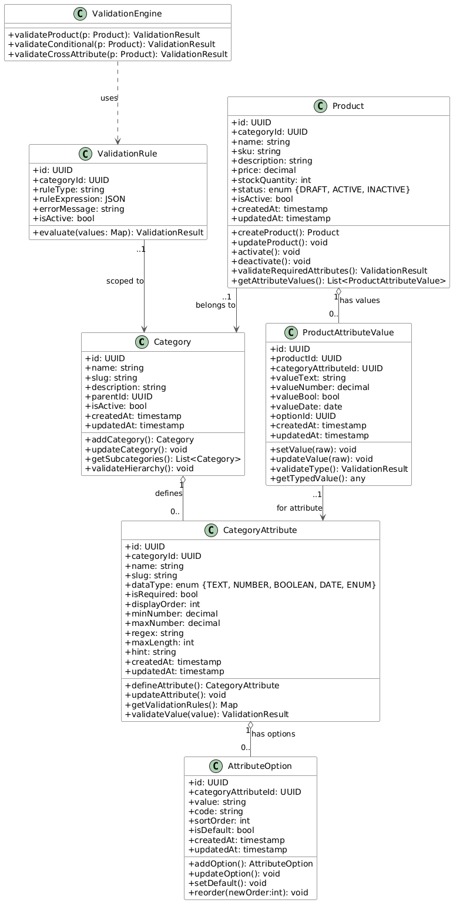

# eCommerce Catalog Management Tool

A scalable internal product management tool that supports dynamic categories and custom attributes using the Entity-Attribute-Value (EAV) pattern.

## 🎯 Features

- **Dynamic Categories**: Create unlimited product categories with hierarchy support
- **Custom Attributes**: Define category-specific attributes with validation rules
- **Flexible Data Types**: Support for TEXT, NUMBER, BOOLEAN, DATE, and ENUM attributes  
- **Product Management**: Create and manage products with dynamic attribute values
- **Validation Engine**: Enforce required attributes and data type constraints
- **Modern UI**: Clean, responsive interface built with React and Ant Design

## 🏗️ Architecture

### Database Design (Step 1)
- **EAV Pattern**: Enables unlimited scalability without schema changes
- **Strong Typing**: Typed value storage with validation constraints
- **Referential Integrity**: Comprehensive foreign key relationships
- **Performance Optimized**: Strategic indexing and query optimization

### Class Design (Step 2)  
- **Clean Architecture**: Separation of concerns with service layers
- **Strategy Pattern**: Extensible validation logic
- **Future-Proof**: Ready for multi-category products and advanced rules

### Implementation (Step 3)
- **Backend**: NestJS + TypeScript + Prisma + PostgreSQL
- **Frontend**: React + TypeScript + Ant Design
- **API**: RESTful with OpenAPI documentation
- **Validation**: Comprehensive data validation and business rules

Step 1: Database Design

Deliverables:

ERD (Entity Relationship Diagram): docs/images/erd-diagram.png

Design write-up: docs/database-design.md

ERD Preview

Justification

Scalability via EAV: The schema uses an Entity–Attribute–Value (EAV) pattern, so new categories and attributes require only data inserts, not schema changes or migrations.

Normalization & Integrity: Category-scoped attribute definitions live in category_attributes; product values live in product_attribute_values with strong foreign keys (FKs) and unique constraints to enforce 3NF and avoid duplication.

Typed Validation: Columns for value_text / value_number / value_bool / value_date plus option_id for ENUM. Validation metadata on category_attributes (min_number, max_number, regex, max_length, is_required, display_order) ensures type- and rule-safety.

Future-Proofing: Category hierarchy (parent_id), soft activation flags, audit timestamps, and attribute_options for enumerations. Easily extensible to multi-category products, conditional validations, and new data types.

Step 2: Class Design

Deliverables:

Class diagram (UML): docs/images/class-diagram.png

Design write-up: docs/class-design.md

Class Diagram Preview

Classes Modeled

Category: Manages hierarchy and lifecycle (add/update/getSubcategories/validateHierarchy)

CategoryAttribute: Defines data type, constraints, and validation rules (define/update/validateValue)

AttributeOption: Manages ENUM options (add/update/setDefault/reorder)

Product: Handles lifecycle and validation coordination (create/update/activate/deactivate/validateRequiredAttributes/getAttributeValues)

ProductAttributeValue: Provides typed storage and enforcement (setValue/updateValue/validateType/getTypedValue)

ValidationRule / ValidationEngine (optional): Structure for conditional and cross-attribute rules

## 🚀 Quick Start

### Prerequisites
- Node.js 20+
- Docker & Docker Compose
- Git

### Setup

1. **Clone the repository**
e-catalog-tool

2. **Start the database**
docker-compose up -d

3. **Setup backend**
cd backend
npm install
npx prisma generate
npx prisma migrate deploy
npx prisma db seed
npm run start:dev

4. **Setup frontend**
cd frontend
npm install
npm run dev

5. **Access the application**
- Frontend: http://localhost:5173
- Backend API: http://localhost:3000
- API Documentation: http://localhost:3000/api

## 📖 Usage

### Managing Categories
1. Navigate to "Categories" page
2. Create category with name, slug, and optional parent
3. Categories support hierarchical structure

### Defining Attributes
1. Select a category from "Attributes" page
2. Create attributes with data type and validation rules
3. Add options for ENUM-type attributes

### Creating Products
1. Go to "Products" page and create a new product
2. Assign to category and set basic product information
3. Use "Attributes" button to set category-specific values
4. Activate product once all required attributes are set

## 🎨 Demo Data

The seed script creates sample data:
- **Categories**: Dresses, Shoes
- **Attributes**: Size (ENUM), Color (TEXT), Length (NUMBER), Brand (TEXT), Waterproof (BOOLEAN)
- **Products**: Sample dress and shoes with attribute values

## 🧪 API Documentation

Interactive API documentation is available at `/api` endpoint when the backend is running.

### Key Endpoints:

**Categories**
- `GET /categories` - List all categories
- `POST /categories` - Create category
- `PATCH /categories/:id` - Update category

**Attributes**  
- `GET /attributes/category/:categoryId` - Get attributes for category
- `POST /attributes` - Create attribute
- `POST /attributes/options` - Create ENUM option

**Products**
- `GET /products` - List products (with pagination/filtering)
- `POST /products` - Create product  
- `POST /products/values` - Set attribute value
- `POST /products/:id/activate` - Activate product (validates required attributes)

## 🔧 Tech Stack

**Backend:**
- NestJS (Node.js framework)
- Prisma (ORM) 
- PostgreSQL (Database)
- TypeScript
- Swagger/OpenAPI

**Frontend:**
- React 18
- TypeScript
- Ant Design (UI components)
- React Query (State management)
- React Router (Navigation)

**DevOps:**
- Docker & Docker Compose
- ESLint & Prettier
- GitHub Actions (CI/CD ready)

## 🏆 Design Highlights

### Scalability
- **Zero-downtime expansion**: Add new categories/attributes without code changes
- **Unlimited attributes**: EAV pattern supports any number of custom fields
- **Performance**: Optimized queries with strategic indexing

### Data Integrity
- **Typed validation**: Enforce data types and constraints at API level
- **Required attributes**: Prevent product activation without mandatory fields
- **Referential integrity**: Cascade deletes and relationship constraints

### User Experience  
- **Dynamic forms**: UI adapts based on attribute definitions
- **Validation feedback**: Real-time validation with helpful error messages
- **Intuitive workflow**: Category → Attributes → Products logical flow

📂 Repository Structure
text
ecommerce-catalog-manager/
├── README.md
├── docker-compose.yml
├── setup.sh
├── .gitignore
├── .github/workflows/ci.yml
├── docs/
│   ├── database-design.md
│   ├── class-design.md
│   └── images/
│       ├── erd-diagram.png
│       └── class-diagram.png
├── backend/
│   ├── package.json
│   ├── tsconfig.json
│   ├── .env.example
│   ├── prisma/
│   │   ├── schema.prisma
│   │   └── seed.ts
│   └── src/
│       ├── main.ts
│       ├── app.module.ts
│       ├── prisma/
│       │   ├── prisma.module.ts
│       │   └── prisma.service.ts
│       ├── categories/
│       ├── attributes/
│       └── products/
└── frontend/
    ├── package.json
    ├── vite.config.ts
    └── src/
        ├── main.tsx
        ├── App.tsx
        ├── api/client.ts
        └── pages/
            ├── CategoriesPage.tsx
            ├── AttributesPage.tsx
            └── ProductsPage.tsx

## 📈 Extensibility

The architecture supports future enhancements:

- **Multi-category products**: Ready for products in multiple categories
- **Advanced validation**: Conditional rules and cross-attribute dependencies  
- **Extended data types**: File uploads, rich text, geospatial data
- **Workflow states**: Extended product lifecycle management
- **Search & filtering**: Full-text search and advanced filtering

## 📝 License

MIT License - see LICENSE file for details
5. Final Setup Commands
